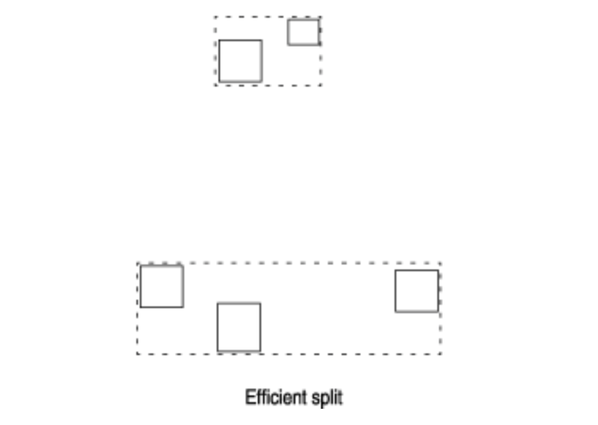
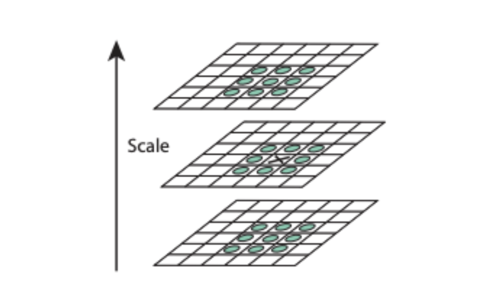
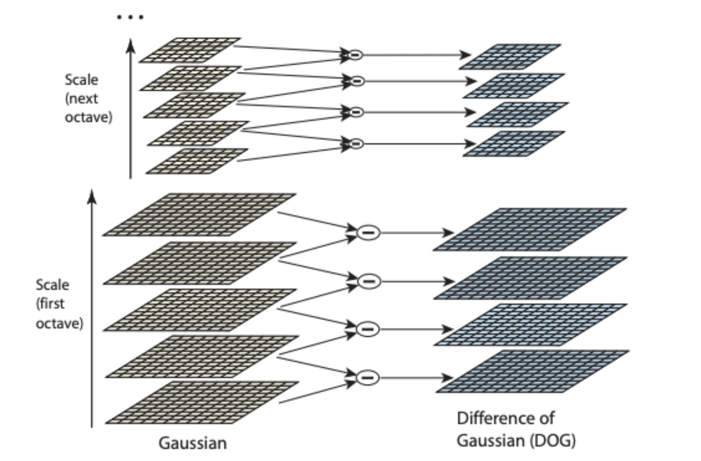
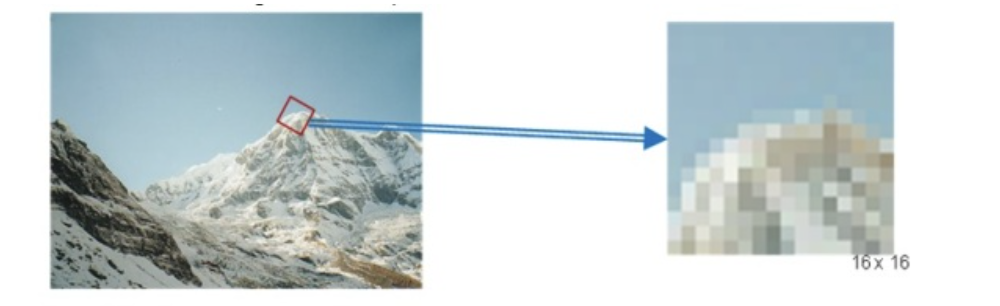
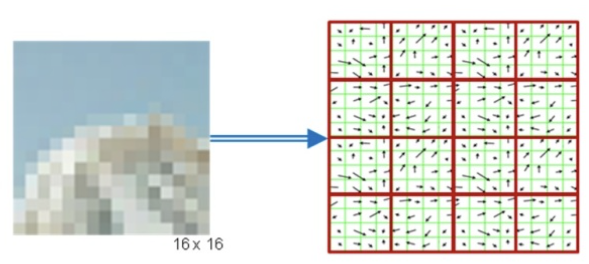
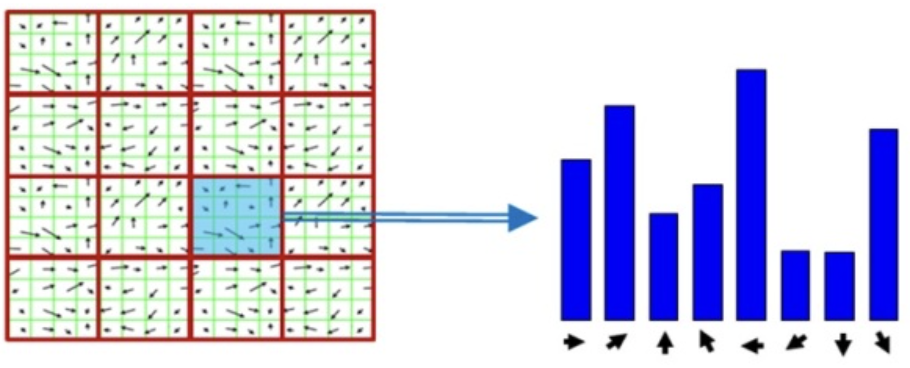
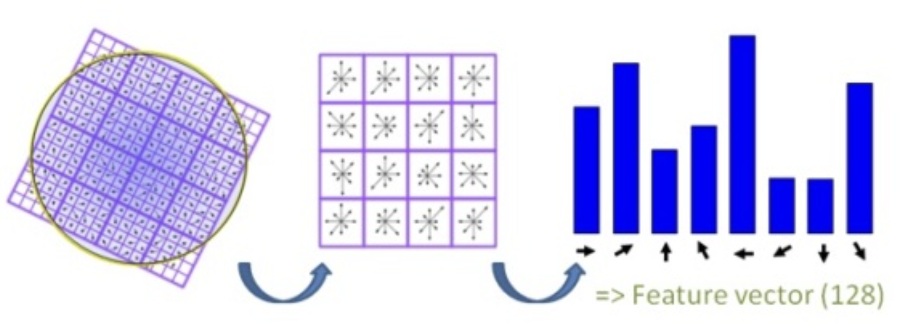

#  Proyecto 2 - Base de Datos II
## Introducción

### Objetivo del Proyecto

El objetivo de este proyecto es implementar un sistema de recuperación de información utilizando un índice invertido y comparar su rendimiento con PostgreSQL. Se evaluará el tiempo de consulta en diferentes tamaños de datos y se generarán gráficos para visualizar los resultados.

### Descripción del Dominio de Datos y la Importancia de Aplicar Indexación

El dominio de datos consiste en letras de canciones de Spotify. La indexación es crucial para mejorar la eficiencia de las consultas textuales en grandes volúmenes de datos, permitiendo recuperar resultados relevantes de manera rápida.

## Backend: Índice Invertido

### Implementación del Índice Invertido

### Construcción del Índice Invertido en Memoria Secundaria

El algoritmo BSBI (Blocked Sort-Based Indexing) permite construir un índice invertido eficientemente utilizando memoria secundaria (disco) en lugar de cargar todo en la RAM. Este método se divide en varias etapas clave: construcción de índices locales, fusión de bloques, y optimización de consultas  textuales mediante similitud de coseno.

#### Componentes Principales

1. **`TextProcessor`**: Clase para preprocesar texto, incluyendo la eliminación de stopwords y la normalización mediante stemming.
2. **`InvertIndex`**: Clase para construir y almacenar un índice invertido.
3. **`BSBI`**: Clase principal que gestiona la creación de bloques de índice, la fusión de estos bloques y la recuperación de información.

#### Optimización
Se implementa una caché LRU (`LRUCache`) para optimizar el acceso a los bloques de índice, reduciendo las operaciones de lectura desde el disco.

#### Descripción de Clases y Métodos

##### Clase `LRUCache`
Esta clase implementa una caché LRU usando `OrderedDict` para manejar el almacenamiento de los bloques de índice más recientemente utilizados.

- **`__init__(self, capacity)`**: Inicializa la caché con una capacidad específica.
- **`get(self, key)`**: Recupera un elemento de la caché y lo mueve al final para marcarlo como recientemente utilizado.
- **`put(self, key, value)`**: Inserta un nuevo elemento en la caché y elimina el menos recientemente utilizado si se supera la capacidad.

##### Clase `TextProcessor`
Esta clase se encarga del preprocesamiento de texto.

- **`__init__(self, lang)`**: Inicializa el procesador de texto con un stemmer y una lista de stopwords para un idioma específico.
- **`preprocess(self, text)`**: Normaliza y elimina stopwords del texto.
- **`calculate_tf(self, doc)`**: Calcula la frecuencia de términos normalizada (tf) de un documento.

##### Clase `InvertIndex`
Esta clase construye y almacena el índice invertido.

- **`__init__(self, index_file, lang)`**: Inicializa el índice invertido con un archivo de destino y un procesador de texto.
- **`calculate_idf(self, collection)`**: Calcula la frecuencia inversa de los documentos (idf) para una colección de documentos.
- **`building(self, data)`**: Construye el índice invertido y almacena los datos en un archivo.

##### Clase `BSBI`
Esta es la clase principal que gestiona la construcción y manejo del índice invertido en bloques.

- **`__init__(self, initial_block_size, block_size, data_path, lang, lang_abbr, index_dir, rebuild=False, cache_size=10)`**: Inicializa los parámetros del índice BSBI y gestiona la construcción o carga del índice.
- **`store_index(self, index_file, index, idf, length)`**: Almacena un bloque de índice en un archivo.
- **`build_local_indexes(self)`**: Construye índices locales a partir de bloques de documentos.
- **`merge_two_sorted_arrays(self, arr1, arr2)`**: Fusiona dos listas ordenadas de tuplas (doc_id, tf).
- **`load_index_block(self, block_filename)`**: Carga un bloque de índice desde el archivo, usando la caché LRU.
- **`merge_two_rows(self, row1, row2, count=0, level=0)`**: Fusiona dos filas de bloques de índice, combinando sus términos.
- **`merge_blocks(self)`**: Gestiona la fusión de todos los bloques de índice hasta que solo queda un bloque final.
- **`clean_dir(self, dir_path)`**: Limpia un directorio especificado.
- **`build_index(self)`**: Construye el índice completo a partir de bloques locales y fusiona los bloques.
- **`retrieval(self, query, k=10)`**: Recupera los documentos más relevantes para una consulta utilizando la búsqueda binaria en los bloques de índice.
- **`get_ordered_block_filenames(self, final_dir)`**: Obtiene una lista ordenada de archivos de bloques en un directorio.
- **`add_index_keys(self, block_filename)`**: Añade las primeras y últimas claves de cada bloque de índice.
- **`load_index(self)`**: Carga el índice desde los archivos de bloques.

#### Optimización de Consultas

- **Caché LRU**: Implementación de una caché LRU para almacenar bloques de índice recientemente utilizados y reducir el tiempo de acceso a disco.
- **Búsqueda Binaria**: Utilización de búsqueda binaria para localizar los bloques relevantes durante las consultas, utilizando una lista de primeras y últimas claves para cada bloque.

#### Algoritmo BSBI

1. **Construcción de Índices Locales**: Los documentos se procesan en bloques de tamaño fijo. Cada bloque se indexa y almacena en un archivo separado.
2. **Fusión de Bloques**: Los bloques de índice se fusionan en niveles hasta que solo queda un bloque final.
3. **Consultas**: Las consultas se procesan buscando los términos en los bloques relevantes usando búsqueda binaria, y se calculan los puntajes de relevancia utilizando la similitud del coseno.

##### Construcción de Índices Locales

La construcción del índice invertido comienza con la creación de índices locales para bloques de documentos. Cada bloque se procesa por separado, almacenando su índice en un archivo en el disco.

**Fragmento de código relevante:**

```python
def build_local_indexes(self):
    print("Building local indexes")
    block_num = 0
    docs = {}

    with open(self.data_path, 'r') as f:
        reader_obj = csv.reader(f) 
        for row in reader_obj:
            if(row[-1] != self.lang_abbr):
                continue
            docs[row[0]] = row[3]
            if len(docs) == self.initial_block_size:
                block_index_file = os.path.join(self.index_dir, f'block_{block_num}.pkl')
                invert_index = InvertIndex(block_index_file, self.lang)
                invert_index.building(docs)
                self.block_filenames.append(block_index_file)
                docs = {}
                block_num += 1
        if docs:
            block_index_file = os.path.join(self.index_dir, f'block_{block_num}.pkl')
            invert_index = InvertIndex(block_index_file, self.lang)
            invert_index.building(docs)
            self.block_filenames.append(block_index_file)
    print("Local indexes built")
```

- **Explicación**: Este método procesa el archivo de datos en bloques de tamaño `initial_block_size`. Cada bloque se indexa utilizando la clase `InvertIndex` y se guarda en un archivo (`block_num.pkl`). Los archivos de índice de los bloques se almacenan en el disco, evitando cargar todos los datos en RAM simultáneamente.

##### Clase `InvertIndex` para Construcción de Índices Locales

**Fragmento de código relevante:**

```python
class InvertIndex:
    def __init__(self, index_file, lang):
        self.index_file = index_file
        self.index = {}
        self.idf = {}
        self.length = {}
        self.processor = TextProcessor(lang)

    def building(self, data):
        processed_collection = {doc_id: self.processor.preprocess(text) for doc_id, text in data.items()}
        for doc_id, words in processed_collection.items():
            tf = self.processor.calculate_tf(words)
            for word, tf_value in tf.items():
                if word not in self.index:
                    self.index[word] = []
                self.index[word].append((doc_id, tf_value))
            self.length[doc_id] = np.linalg.norm(list(tf.values()))
        self.calculate_idf(processed_collection)
        self.index = dict(sorted(self.index.items()))
        with open(self.index_file, 'wb') as f:
            pickle.dump((self.index, self.idf, self.length), f)
```

- **Explicación**: La clase `InvertIndex` procesa los documentos en un bloque, calcula las frecuencias de término (tf), y construye el índice invertido para ese bloque. Luego, calcula la frecuencia inversa de documento (idf) y guarda el índice en un archivo utilizando `pickle`.

##### Fusión de Bloques

Una vez que se han construido los índices locales, estos bloques se fusionan en niveles hasta que solo queda un bloque final.

**Fragmento de código relevante:**

```python
def merge_blocks(self):
    print("Merging blocks")
    filenames = [[filename] for filename in self.block_filenames]
    level = 0
    while len(filenames) > 1:
        print(f"Number of blocks: {len(filenames)}")
        print(filenames)
        new_level = []
        for i in range(0, len(filenames), 2):
            if i + 1 < len(filenames):
                merged_files = self.merge_two_rows(filenames[i], filenames[i + 1], i // 2, level)
                new_level.append(merged_files)
            else:
                new_level.append(filenames[i])
        filenames = new_level
        level += 1
    final_dir = os.path.join(self.index_dir, 'final')
    os.rename(os.path.join(self.index_dir, f'level_{level-1}'), final_dir)
    self.block_filenames = [[f'{final_dir}/{os.path.split(filename)[-1]}' for filename in filenames[0]]]
```

- **Explicación**: Este método fusiona pares de bloques de índice hasta que solo queda un bloque final. Los bloques se combinan nivel por nivel, y los bloques fusionados se almacenan en nuevos archivos. El índice final son los bloques del último nivel almacenado en el directorio `final`.

##### Ejecución Óptima de Consultas aplicando Similitud de Coseno

La recuperación de documentos relevantes se realiza utilizando la similitud de coseno. Esto implica calcular el producto punto entre los vectores tf-idf de la consulta y los documentos, y luego normalizar por la longitud de los vectores.

**Fragmento de código relevante:**

```python
def retrieval(self, query, k=10):
    def binary_search_term(block_keys, blocks, term):
        left, right = 0, len(block_keys) // 2 - 1
        while left <= right:
            mid = (left + right) // 2
            f_key, l_key = block_keys[2 * mid], block_keys[2 * mid + 1]
            if f_key <= term <= l_key:
                index_mid, idf_mid, length = self.load_index_block(blocks[mid])
                if term in index_mid:
                    tf_values = index_mid[term]
                    idf_value = idf_mid.get(term, 0)
                    return tf_values, idf_value, length
                else:
                    return None, None, None
            if term < f_key:
                right = mid - 1
            else:
                left = mid + 1
        return None, None, None

    query_words = self.processor.preprocess(query)
    words_tf = {}
    words_idf = defaultdict(float)
    length = {}

    for word in query_words:
        tf_values, idf_value, local_length = binary_search_term(self.index_keys, self.block_filenames[0], word)
        if tf_values is not None:
            words_tf[word] = tf_values
            words_idf[word] = idf_value
            if not length:
                length = local_length

    query_tf = self.processor.calculate_tf(query_words)
    query_tfidf = {word: tf * words_idf.get(word, 0) for word, tf in query_tf.items()}

    scores = defaultdict(float)
    for word, tfidf in query_tfidf.items():
        if word in words_tf:
            for doc_id, tf_value in words_tf[word]:
                scores[doc_id] += tfidf * tf_value

    for doc_id in list(scores.keys()):
        scores[doc_id] /= length[doc_id]

    result = sorted(scores.items(), key=lambda tup: tup[1], reverse=True)
    return result[:k]
```

- **Explicación**: Este método realiza una consulta utilizando búsqueda binaria para encontrar los términos en los bloques de índice relevantes. Luego, calcula la similitud de coseno entre la consulta y los documentos utilizando los valores tf-idf. Los documentos se ordenan por relevancia y se devuelven los `k` documentos más relevantes.

##### Optimización mediante la Caché LRU

Para mejorar la eficiencia, se utiliza una caché LRU para almacenar bloques de índice recientemente utilizados, minimizando las operaciones de lectura desde el disco.

**Fragmento de código relevante:**

```python
class LRUCache:
    def __init__(self, capacity: int):
        self.cache = OrderedDict()
        self.capacity = capacity

    def get(self, key):
        if key not in self.cache:
            return None
        self.cache.move_to_end(key)
        return self.cache[key]

    def put(self, key, value):
        if key in self.cache:
            self.cache.move_to_end(key)
        self.cache[key] = value
        if len(self.cache) > self.capacity:
            self.cache.popitem(last=False)
```

- **Explicación**: La caché LRU (Least Recently Used) se implementa usando `OrderedDict`. Almacena un número limitado de bloques de índice y elimina el menos recientemente utilizado cuando se alcanza la capacidad máxima. Esto reduce el número de lecturas desde el disco, mejorando la velocidad de las consultas.

### API
La API permite realizar búsquedas por letras de canciones usando el índice y obtener información detallada a través de la API de Spotify.

La API está construida usando FastAPI.

### Funcionalidad Principal
- **Búsqueda de Canciones**: La API permite buscar canciones por letra. El índice retorna un arreglo con los top `k` resultados, cada uno conteniendo el ID de la canción y su puntuación de relevancia.
- **Obtención de Información de Spotify**: Utilizando el ID de la canción, la API consulta la API de Spotify para obtener información detallada de la canción, como el nombre, artistas, álbum, URL de previsualización y la imagen del álbum.

#### Endpoint Principal

##### POST `/search`
Permite realizar una búsqueda de canciones.

**Request**
- **Cuerpo de la Solicitud**:
  ```json
  {
    "query": "string",  // La consulta de búsqueda.
    "k": 10,            // Número de resultados a retornar. Valor por defecto: 10.
    "language": "spanish", // Idioma de las letras a buscar ("spanish" o "english"). Valor por defecto: "spanish".
    "use_postgres": false  // Indica si se debe usar PostgreSQL para la búsqueda. Valor por defecto: false.
  }
  ```

**Response**
- **Formato de la Respuesta**:
  ```json
  {
    "songs": [
      {
        "id": "string",          // ID de la canción en Spotify.
        "score": "float",          // Puntuación de relevancia de la canción.
        "name": "string",        // Nombre de la canción.
        "artists": ["string"],   // Lista de nombres de los artistas.
        "album": "string",       // Nombre del álbum.
        "preview_url": "string", // URL de previsualización de la canción (si está disponible).
        "album_image": "string"  // URL de la imagen del álbum.
      }
    ],
    "executionTime": "float"  // Tiempo de ejecución de la búsqueda en milisegundos.
  }
  ```

##### Cómo Funciona la API

1. **Inicialización**:
   - La API se inicializa creando dos índices BSBI, uno para canciones en español y otro para canciones en inglés, utilizando los datos de `spotify_songs.csv`.

2. **Recepción de la Solicitud**:
   - El endpoint `/search` recibe una solicitud POST con la consulta de búsqueda, el número de resultados deseados, el idioma de las canciones y si se debe utilizar PostgreSQL o el índice propio para la búsqueda.

3. **Búsqueda en el Índice**:
   - Dependiendo del idioma especificado (`spanish` o `english`), se selecciona el índice BSBI correspondiente.
   - Se realiza la búsqueda en el índice y se obtienen los top `k` resultados (ID de la canción y puntuación).

4. **Consulta a la API de Spotify**:
   - Para cada resultado, se usa el ID de la canción para obtener información detallada desde la API de Spotify.
   - La información obtenida se simplifica para incluir solo los campos necesarios (nombre de la canción, artistas, álbum, URL de previsualización y la imagen del álbum).

5. **Respuesta**:
   - Retorna un objeto JSON con la lista de canciones y el tiempo de ejecución de la búsqueda.

### Construcción del Índice Invertido en PostgreSQL/MongoDB

### Configuración y Creación de la Tabla `songs`

En este proyecto, hemos creado una tabla en PostgreSQL para almacenar información sobre canciones de Spotify. La tabla incluye información detallada sobre cada canción, como el nombre, artista, letra, popularidad, y características acústicas.

#### Código para la Creación de la Tabla

El siguiente fragmento de código crea la tabla `songs` en la base de datos PostgreSQL:

```python
def create_and_populate_table():
    conn = connect_to_postgres()
    if conn:
        cursor = conn.cursor()
        cursor.execute("""
        CREATE TABLE IF NOT EXISTS songs (
            track_id TEXT PRIMARY KEY,
            track_name TEXT,
            track_artist TEXT,
            lyrics TEXT,
            track_popularity INTEGER,
            track_album_id TEXT,
            track_album_name TEXT,
            track_album_release_date DATE,
            playlist_name TEXT,
            playlist_id TEXT,
            playlist_genre TEXT,
            playlist_subgenre TEXT,
            danceability FLOAT,
            energy FLOAT,
            key INTEGER,
            loudness FLOAT,
            mode INTEGER,
            speechiness FLOAT,
            acousticness FLOAT,
            instrumentalness FLOAT,
            liveness FLOAT,
            valence FLOAT,
            tempo FLOAT,
            duration_ms INTEGER,
            language TEXT
        );
        """)
        
        with open(data_path, 'r') as f:
            reader = csv.reader(f)
            next(reader)  # Omitir la cabecera
            for row in reader:
                cursor.execute("""
                INSERT INTO songs (track_id, track_name, track_artist, lyrics, track_popularity, track_album_id, track_album_name, 
                track_album_release_date, playlist_name, playlist_id, playlist_genre, playlist_subgenre, danceability, energy, key, loudness, 
                mode, speechiness, acousticness, instrumentalness, liveness, valence, tempo, duration_ms, language) 
                VALUES (%s, %s, %s, %s, %s, %s, %s, %s, %s, %s, %s, %s, %s, %s, %s, %s, %s, %s, %s, %s, %s, %s, %s, %s)
                """, row)
        
        conn.commit()
        cursor.close()
        conn.close()
```
Esta función crea una tabla en una base de datos PostgreSQL y la popula con datos de un archivo CSV.

Este código realiza lo siguiente:

1. Conecta a la base de datos PostgreSQL.
2. Crea la tabla songs si no existe ya.
3. Inserta datos desde un archivo CSV (spotify_songs.csv) en la tabla.

### Creación de Índices en PostgreSQL
Para optimizar las consultas textuales, se han creado índices en las columnas track_name, track_artist, y lyrics.

#### Código para la Creación de Índices
El siguiente código crea los índices necesarios en la tabla songs:

```python
def create_indexes():
    conn = connect_to_postgres()
    if conn:
        cursor = conn.cursor()
        cursor.execute("CREATE INDEX IF NOT EXISTS idx_track_name ON songs (track_name);")
        cursor.execute("CREATE INDEX IF NOT EXISTS idx_track_artist ON songs (track_artist);")
        cursor.execute("CREATE INDEX IF NOT EXISTS idx_lyrics ON songs USING GIN (lyrics gin_trgm_ops);")
        conn.commit()
        cursor.close()
        conn.close()
```

Aqui se conecta a la base de datos PostgreSQL, crea un índice en la columna track_name para acelerar las búsquedas por nombre de canción.
Luego, crea un índice en la columna track_artist para acelerar las búsquedas por nombre de artista y termina creando un índice GIN en la columna lyrics para optimizar las búsquedas textuales completas.

### Configuración de la API para Búsquedas
La API está configurada utilizando FastAPI para manejar búsquedas en la tabla songs de PostgreSQL y comparar su rendimiento con un índice invertido personalizado (BSBI). La configuración incluye la creación de la tabla songs, la inserción de datos desde un archivo CSV, y la creación de índices en PostgreSQL para optimizar las consultas textuales. La API permite seleccionar entre usar PostgreSQL o los índices invertidos personalizados para realizar las búsquedas, retornando los resultados junto con el tiempo de ejecución de la consulta.

## Backend: Índice Multidimensional

En esta sección se explicarán los métodos y técnicas utilizados para la creación de un índice multidimensional.

### KNN RTree
El código implementa una estructura KNN (K-Nearest Neighbors) utilizando un árbol R (R-Tree) para indexar y buscar imágenes similares empleando descriptores SIFT (Scale-Invariant Feature Transform). A continuación, se describen las principales librerías utilizadas:

#### Librerías Utilizadas

##### rtree

* La librería `rtree` se encarga de la indexación mediante un árbol R, que es un índice multidimensional. Esta librería implementa toda la estructura, permitiendo indexar, realizar búsquedas y configurar los parámetros según nuestros requerimientos.

###### ¿Cómo Funciona?
El R-Tree es un árbol balanceado que se utiliza para indexar objetos en un espacio multidimensional, permitiendo realizar búsquedas eficientes. Con la librería `rtree`, creamos el índice y le asignamos un nombre para que se guarde en disco. Además, configuramos la dimensión en 128, que corresponde a la dimensión de los descriptores SIFT.

```python
p = index.Property()
p.dimension = 128  
self.idx = index.Index(index_path, properties=p)
```


El R-Tree permite indexar elementos, en este caso, descriptores de imágenes. Agrupa estos puntos en rectángulos conocidos como MBR (Minimum Bounding Rectangles). Cada rectángulo es un nodo, donde los nodos internos contienen otros nodos, y las hojas contienen los elementos finales.

Cuando un nodo se llena, se realiza una división (split), creando dos MBR lo más alejados posible entre sí dentro de los valores del nodo. Los elementos del nodo original se redistribuyen en los nuevos MBR y se mantiene el balance del árbol.



Una vez que nuestros elementos están indexados, podemos realizar consultas. Sin embargo, esto se explicará en detalle en la sección sobre cómo se realiza la búsqueda KNN (K-Nearest Neighbors).

#### cv2 (OpenCV)
La librería OpenCV (`cv2`) se utiliza para el procesamiento de imágenes, en este caso para la extracción de características SIFT. El algoritmo detecta puntos clave en imágenes que son puntos invariantes a la escala o rotación.  En el código se implementa durante la construcción del índice RTree, obteniendo los descriptores locales de cada imagen.

``` python
def extract_sift_features(self, image):
    sift = cv2.SIFT_create(nfeatures=self.nfeatures)
    keypoints, descriptors = sift.detectAndCompute(image, None)
    return keypoints, descriptors
```

###### ¿Cómo Funciona? - Proceso de Extracción de Keypoints y Descriptors


1.  **Aplicación de Diferencias Gaussianas**: Se aplica un desenfoque gaussiano a la imagen con diferentes magnitudes.
2. **Restar Imágenes**: Se restan las imágenes resultantes del desenfoque gaussiano entre sí, obteniendo la diferencia de la imagen en diferentes niveles de desenfoque.
3. **Identificación de Extremos Locales**: Se buscan los puntos extremos locales en las imágenes resultantes de las diferencias gaussianas. Estos puntos extremos son los keypoints.


4. **Escalas y Transformaciones**: Este proceso no solo se realiza para la imagen original, sino que se aplica en una pirámide de escalas. Esto implica transformar la imagen en diferentes niveles de escala, rotación e iluminación, asegurando que los keypoints encontrados sean invariantes a estas transformaciones.


**Descripción de los Keypoints:**
1. **Análisis de Vecinos del Keypoint**: Se analiza el área vecina alrededor de cada keypoint.
2. **División en Regiones**: El área vecina se divide en pequeñas regiones.


3. **Cálculo de Gradientes**: Se calcula el gradiente en cada una de estas pequeñas regiones. Los gradientes se utilizan porque preservan mejor los cambios a pesar de variaciones en la iluminación o el punto de vista.


4. **Organización en Histogramas**: Los gradientes calculados se organizan en histogramas. Para cada keypoint, en una región de 4x4 alrededor del punto clave, se calculan 16 histogramas en total.

5. **Discretización en Orientaciones**: Cada histograma se discretiza en 8 orientaciones (cada una de 45 grados), resultando en 128 valores (16 histogramas x 8 orientaciones) que describen el keypoint.


6. **Creación del Descriptor**: Finalmente, se crea un vector de 128 elementos para cada keypoint. Este vector es el descriptor del keypoint.


### Cómo se realiza el KNN Search
#### Cómo realiza el Sequential KNN Search:
El Sequential KNN Search sigue este proceso:
1. Se recibe la query y se extraen los descriptores SIFT.
2. Para cada descriptor de la se inicializa un heap vacío. 
3. Se itera sobre el dataset, obteniendo los descriptores SIFT de cada imagen y se calcula la distancia de cada uno con los descriptores de la consulta, estas se pushean en su respectivo heap.
4. Una vez iteramos todo el dataset, los heaps cuentan con los top k imágenes de cada descriptor de la consulta. Para obtener el top k imágenes de la consulta como tal, aplicamos un counter de los resultados y le asignamos un score a cada imagen vecina (sobre como funciona el score, se explica más adelante),
5. Finalmente, retornamos las top k imágenes según el score. 


#### Cómo realiza el R-Tree KNN Search: 
El KNN (K-Nearest Neighbors) Search en un R-Tree sigue este proceso:
1. Se inicia la búsqueda con una distancia infinita, ya que no se ha hecho ninguna comparación aún. 
2. Se comienza a explorar por el nodo raíz del R-Tree y se usa una cola de prioridad para gestionar los nodos a explorar.
3. Se extrae el nodo más cercano de la cola de prioridad y se realiza una búsqueda en profundidad a través de sus hijos.
4. Si el nodo es una hoja, se calcula la distancia entre la consulta y cada descriptor en la hoja.
5. Si el nodo es interno, se calcula la distancia entre la consulta y el MBR de cada hijo, añadiendo los hijos a la cola de prioridad.
6. Se mantiene una cola de prioridad de los k vecinos más cercanos encontrados hasta el momento y se actualiza mientras se explora.
7. Si un MBR está más lejos que la distancia al k-ésimo vecino más cercano, no se explora.
8. La búsqueda concluye cuando se han encontrado los k vecinos más cercanos y no hay más nodos por explorar. 

Este proceso se realiza para cada descriptor de la imagen consultada.

**Implementación en el Código**
En el código proporcionado, este proceso se aplica para cada descriptor de la imagen consultada mediante el método `knn_search_w_score`:

``` python
def knn_search_w_score(self, descriptor):
    nearest = list(self.idx.nearest(descriptor, self.k))
    score_results = []

    for i, result in enumerate(nearest):
        weight = 1.0 / (i + 1)
        image_id = self.get_image_id_from_index_id(result)
        score_results.append((image_id, weight))

    return score_results
```

#### Filtrado y Puntaje de Imágenes
Una vez obtenidos los k descriptores más cercanos para cada descriptor de la imagen consultada, es necesario identificar cuáles son las k imágenes más similares a la imagen consultada. Esto se realiza de la siguiente manera:

1. **Asignación de Puntajes**:
    *  A las imágenes encontradas se les asigna un puntaje basado en la posición en la que se retornaron sus descriptores cercanos.
    * Los descriptores más cercanos reciben un puntaje más alto.
2. **Acumulación de Puntajes**:
    * Se acumulan los puntajes para cada imagen encontrada.
3. **Selección de Imágenes**:
    * Finalmente, se seleccionan las k imágenes con los puntajes más altos como las más similares a la imagen consultada.

``` python
 def query(self, image):
    keypoints, descriptors = self.extract_sift_features(image)
    image_scores = Counter()

    for descriptor in tqdm(descriptors, total=len(descriptors), desc='KnnRTree (query): '):
      score_results = self.knn_search_w_score(descriptor)

      for image_id, weight in score_results:
        image_scores[image_id] += weight

    top_k_images = image_scores.most_common(self.k)

    return top_k_images
```

### Análisis de la Maldición de la Dimensionalidad y Cómo Mitigarlo

La maldición de la dimensionalidad se refiere a diversos fenómenos que ocurren cuando se analiza y organiza datos en espacios de alta dimensión. En el contexto de la búsqueda y la indexación de imágenes, estos fenómenos pueden afectar negativamente la eficiencia y la precisión de las búsquedas.

#### Problemas Causados por la Maldición de la Dimensionalidad

1. **Distancias Menos Discriminativas**: A medida que aumenta la dimensionalidad del espacio de características, las distancias entre puntos (imágenes) se vuelven menos discriminativas, lo que dificulta la distinción entre imágenes similares y no similares.
2. **Mayor Complejidad Computacional**: El tiempo y los recursos necesarios para calcular distancias y realizar búsquedas aumentan exponencialmente con la dimensionalidad.
3. **Esparcimiento de Datos**: Los datos tienden a dispersarse en espacios de alta dimensión, lo que reduce la densidad de los datos y dificulta la formación de clusters significativos.

#### Mitigación de la Maldición de la Dimensionalidad

La maldición de la dimensionalidad se refiere a diversos fenómenos que ocurren cuando se analiza y organiza datos en espacios de alta dimensión. En el contexto de la búsqueda y la indexación de imágenes, estos fenómenos pueden afectar negativamente la eficiencia y la precisión de las búsquedas.

#### Problemas Causados por la Maldición de la Dimensionalidad

1. **Distancias Menos Discriminativas**: A medida que aumenta la dimensionalidad del espacio de características, las distancias entre puntos (imágenes) se vuelven menos discriminativas, lo que dificulta la distinción entre imágenes similares y no similares.
2. **Mayor Complejidad Computacional**: El tiempo y los recursos necesarios para calcular distancias y realizar búsquedas aumentan exponencialmente con la dimensionalidad.
3. **Esparcimiento de Datos**: Los datos tienden a dispersarse en espacios de alta dimensión, lo que reduce la densidad de los datos y dificulta la formación de clusters significativos.

#### Solución frente a la Maldición de la Dimensionalidad

Para mitigar los efectos de la maldición de la dimensionalidad, hemos utilizado PCA (Análisis de Componentes Principales). PCA es una técnica de reducción de dimensionalidad que transforma el espacio original de características en un espacio de menor dimensión, preservando la mayor cantidad posible de varianza de los datos originales. 

El proceso de PCA incluye los siguientes pasos:

1. **Normalización de los Datos**: Las características de las imágenes son escaladas para que tengan media cero y varianza unitaria, asegurando que cada característica contribuya equitativamente al análisis.
2. **Cálculo de la Matriz de Covarianza**: Se calcula la matriz de covarianza de los datos normalizados para identificar la correlación entre diferentes características.
3. **Cálculo de los Valores y Vectores Propios**: Se calculan los valores y vectores propios de la matriz de covarianza. Los vectores propios representan las direcciones principales (componentes principales) en las que los datos varían, y los valores propios indican la cantidad de varianza en esas direcciones.
4. **Selección de Componentes Principales**: Se seleccionan los componentes principales con los valores propios más altos, reduciendo así la dimensionalidad mientras se preserva la mayor cantidad posible de información original.
5. **Transformación de los Datos**: Los datos originales se proyectan en el nuevo espacio de componentes principales, obteniendo un conjunto de características de menor dimensión.

##### Beneficios de Usar PCA para Imágenes

1. **Preservación de Información Esencial**: PCA permite reducir la dimensionalidad de las características de las imágenes mientras se preserva la mayor cantidad de varianza (información) posible. Esto es crucial para asegurar que las características discriminativas de las imágenes se mantengan intactas.
2. **Mejor Discriminación de Distancias**: Con una menor dimensionalidad, las distancias entre las características de las imágenes se vuelven más representativas de sus similitudes reales, mejorando la precisión de las búsquedas KNN y Range Search.
3. **Eficiencia Computacional**: Reducir la dimensionalidad disminuye el tiempo y los recursos necesarios para calcular distancias y realizar búsquedas, lo cual es especialmente beneficioso cuando se trabaja con grandes conjuntos de datos de imágenes.
4. **Reducción del Ruido**: Al enfocarse en los componentes principales, PCA ayuda a eliminar el ruido y las características redundantes de los datos, mejorando la calidad de las características utilizadas para la búsqueda.

En comparación con otras técnicas de reducción de dimensionalidad, como el t-SNE o UMAP, PCA es lineal y relativamente sencilla de implementar, lo cual la hace más adecuada para aplicaciones en tiempo real y con grandes volúmenes de datos. Además, su capacidad para preservar la varianza y mejorar la discriminación de distancias la hace especialmente útil en el contexto de la indexación y búsqueda de imágenes, donde la precisión y la eficiencia son cruciales.

## Frontend
Para el diseño del Frontend optamos por una página web con un diseño minimalista y sencillo para el usuario. Este fue construido usando Next.js y Typescript. El componente principal es la barra de búsqueda, donde se ingresa la letra de la canción. Además, se pueden modificar diferentes parámetros como el Top K resultados, el lenguaje y tipo de índice.

### Diseño de la GUI
El diseño está inspirado en Spotify, ya que las canciones indexadas son de esta plataforma. Lo hicimos simple y usando su paleta de colores.


#### Entradas
1. Entrada de la letra de la canción.


2. Entrada del Top k resultados. 


3. Entrada del lenguaje del índice.


4. Entrada del índice a utilizar.


#### Mini-manual de Usuario
#### Realizar consultas textuales
1. Completar las entradas según sus requerimientos. Y presionar el ícono de buscar.


2. Se retornan los resultados. 


3. Si la canción cuenta con un preview proporcionado por Spotify, podrá pulsar el ícono de reproducir y pausar canción. 


### Análisis Comparativo Visual con Otras Implementaciones
A continuación, las capturas de pantallas de otras plataformas que permiten buscar canciones por su letra:

**Letras**


**Lyrics**


**Find Music By Lyrics**


**Google**


**Spotify**


Nuestro frontend combina lo mejor de otras implementaciones, combinando la limpieza y minimalismo de Google con lo visual de Spotify. Además, diferente a otras soluciones, no sobrecargamos la interfaz con anuncios o paneles, como en Letras y Lyrics. Conservando lo esencial, la barra de búsqueda. 
## Experimentación

### Índice multidimensional

Para el índice multidimensional comparamos el KKN Sequential con el KNN-Rtree (D = 128) y el HighD (D = [32, 16, 8]).

Estos fueron los resultados según el tamaño de la colección (N):

**N = 1000**
KNN Secuencial y KNN-RTree


HighD (D = 32)


HighD (D = 16)


HighD (D = 8)


**N = 2000**
KNN Secuencial y KNN-RTree


HighD (D = 32)


HighD (D = 16)


HighD (D = 8)


**N = 4000**
KNN Secuencial y KNN-RTree


HighD (D = 32)


HighD (D = 16)


HighD (D = 8)


**N = 8000**
KNN Secuencial y KNN-RTree


HighD (D = 32)


HighD (D = 16)


HighD (D = 8)


**N = 16000**
KNN Secuencial y KNN-RTree


HighD (D = 32)


HighD (D = 16)


HighD (D = 8)


**N = 32000**
KNN Secuencial y KNN-RTree


HighD (D = 32)


HighD (D = 16)


HighD (D = 8)


**N = 44000**
KNN Secuencial y KNN-RTree


HighD (D = 32)


HighD (D = 16)


HighD (D = 8)


**Resultados de Tiempos de Ejecución (s) - Query**

| Tamaño colección | KNN-Secuencial | KNN-RTree (128d) | HighD (32d) | HighD (16d) | HighD (8d) |
|------------------|----------------|------------------|-------------|-------------|------------|
| 1000             | 7.55           | 0.91             | 0.31        | 0.14        | 0.02       |
| 2000             | 14.66          | 1.73             | 0.61        | 0.21        | 0.03       |
| 4000             | 28.37          | 3.75             | 1.23        | 0.39        | 0.04       |
| 8000             | 57.78          | 8.03             | 2.53        | 0.68        | 0.07       |
| 16000            | 113.92         | 16.57            | 5.51        | 1.41        | 0.11       |
| 32000            | 226.67         | 37.04            | 12.66       | 3.15        | 0.25       |
| 44000            | 326.41         | 77.58            | 16.76       | 4.24        | 0.21       |


En la gráfica se puede ver la comparación más clara:


También, podemos hacer una comparación de cada método con el KNN secuencial y así determinar cuántas veces más rápido son:

| Tamaño colección | KNN-RTree (128d) | HighD (32d) | HighD (16d) | HighD (8d) |
|------------------|------------------|-------------|-------------|------------|
| 1000             | x8               | x24         | x54         | x378       |
| 2000             | x8               | x24         | x70         | x489       |
| 4000             | x8               | x23         | x73         | x709       |
| 8000             | x7               | x23         | x85         | x825       |
| 16000            | x7               | x21         | x81         | x1036      |
| 32000            | x6               | x18         | x72         | x907       |
| 44000            | x3               | x14         | x53         | x1079      |


### Análisis y Discusión
En la experimentación, podemos observa que a mayor dimensionalidad, mayor es el tiempo de ejecución. Además que aplicando técnicas de indexación como el R-Tree podemo reducir considerablemente el tiempo de una búsqueda KNN en comparación de una secuencial. Por otro lado, se visualiza que a medida que se reduce la dimensiolidad del índice, se pierden algunas características de búsqueda, sin embargo, los resultados siguen siendo buenos. Finalmente, en términos de uso, se puede decir que si queremos velocidad la mejor opción es el HighD (D = 8), y si buscamos un poco más de fiabilidad podemos usar el D = 16 o D = 32; y si queremos obtener los resultados exactos podemos optar por un R-Tree que es más rápido que un KNN Secuencial y retorna los mismos vecinos.  